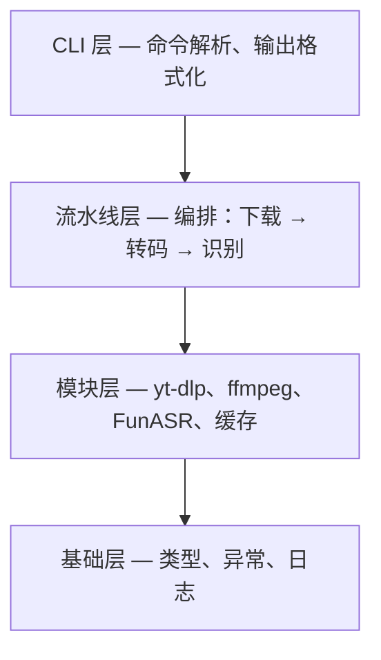
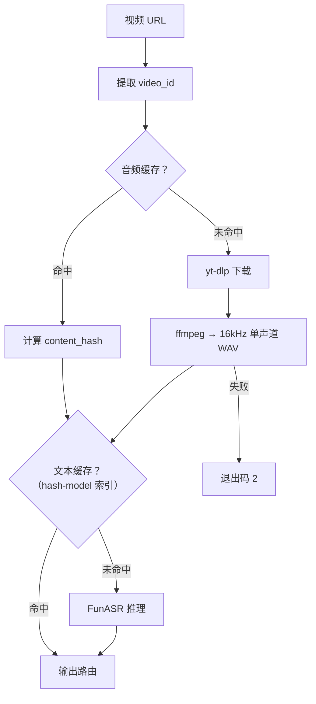

# 架构设计 — Vid2Text-Skill

**Languages**: [English](architecture.md)

## 1. 概述

Vid2Text-Skill 从视频链接下载音频并完成本地语音转文字，基于 yt-dlp 覆盖绝大部分主流视频平台。以 `.skill` 文件分发供 AI Agent 调用。

**核心目标**：零 API 依赖、Agent 优先的输出契约、默认容错。

## 2. 分层架构

四层，仅允许自上而下依赖。层间通过带类型 dataclass 契约通信，无裸字典、无抽象基类。

## 3. 模块边界

| 模块 | 负责 | 不负责 |
|------|------|--------|
| `cli.py` | 参数解析、输出格式化 | 业务逻辑、外部进程 |
| `pipeline.py` | 流程编排、结果补全 | 文件 I/O、外部工具调用 |
| `downloader.py` | URL 校验、yt-dlp、音频缓存 | 转码、ASR |
| `transcoder.py` | ffmpeg → 16kHz 单声道 WAV | 下载、识别 |
| `recognizer.py` | 模型解析、FunASR 推理、文本缓存 | 音频获取、格式转换 |
| `cache.py` | 哈希计算、两层 Key、文件系统索引 | 内容语义 |
| `utils.py` | 异常、日志、类型契约 | 业务工作流 |

## 4. 数据流

- **主路径**：`URL → 下载 → 转码 → ASR → 输出`
- **缓存完全命中**：跳过下载和推理，毫秒级完成
- **转码失败**：立即以退出码 2 终止（硬性前置条件）

输出路由：无 `-o` 时 STDOUT 输出全文；有 `-o` 时文件存储结果，STDOUT 仅输出 `文件路径 \t 字数 \t 时长秒`。

## 5. 关键设计决策

### 两层缓存 Key

音频以 `video_id` 索引（下载前即可提取），实现免网络短路。文本以 `{content_hash}-{model_alias}` 索引，隔离 Paraformer 与 SenseVoice 的结果。切换模型无需手动清缓存，同一音频文件无论来源均映射到相同文本缓存条目。

### 先算完整结果再路由

流水线先计算完整识别结果再选择输出路径，规避流式输出复杂性，使 Agent 的解析面始终可预测：完整正文或一行摘要。

### 缓存宽容降级

缓存读取失败静默视为未命中，回落至完整路径；写入失败仅记录警告。缓存仅是加速机制，非正确性依赖。

### 三档退出码

| 码 | 含义 | Agent 处置 |
|----|------|------------|
| 0 | 成功 | 呈现输出 |
| 1 | 用户错误（无效 URL、文件缺失、未知模型） | 报告，等待修正 |
| 2 | 系统错误（依赖缺失、下载/转码/ASR 失败） | 排查环境 |

码 1 用户可自行修正，码 2 需环境排查。

## 6. 错误处理策略

### 异常层级

所有异常继承自 `Vid2TextError`。三个分支：`UserError`（输入问题）、`DependencyError`（yt-dlp/ffmpeg 故障）、`ModelError`（ASR 加载或推理异常）。

### 各层容错

| 层 | 策略 |
|----|------|
| CLI | 捕获全部，映射为退出码；堆栈不泄露 |
| 流水线 | 向上传播 — 每阶段要么成功要么终止链路 |
| 模块 | 外部错误转为具类型异常 |
| 缓存 | 读路径永不抛异常；缺失或损坏返回 `None` |

### 容错姿态

| 场景 | 行为 |
|------|------|
| 模型未缓存 | 从 ModelScope 自动下载（~1–2 GB） |
| 缓存写入失败 | 警告，以成功结果继续 |
| 转码失败 | 立即退出码 2（ffmpeg 为硬依赖） |
| 单个 ASR 分句失败 | 跳过，继续 |
