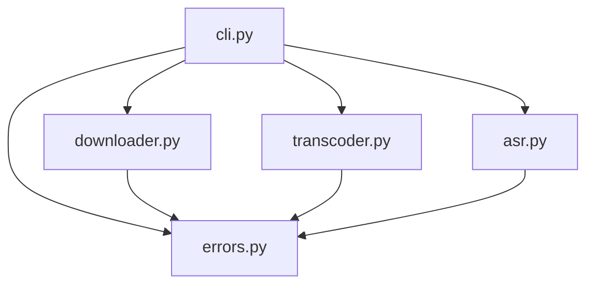
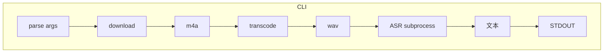

# 项目架构

Vid2Text 从 B站视频链接提取音频，通过 SenseVoice.cpp GGUF 模型进行语音识别，输出纯文本转写结果。

## 流水线


## 技术栈

| 层 | 技术 |
|----|------|
| 音频下载 | urllib + B站 Web API |
| 音频转码 | PyAV（`av`） |
| 语音识别 | SenseVoice.cpp GGUF (Q4_K) + C 二进制 subprocess 调用 |
| CLI 框架 | click |
| 打包 | `scripts/build_skill.py` 生成 `.skill` zip 产物 |

## 目录结构

```
Vid2Text-Skill/
├── vid2text/            # 核心包
├── tests/               # pytest 测试
├── bin/                 # 预编译 sense-voice 二进制（三平台）
├── models/              # GGUF 模型文件
├── scripts/             # build_skill.py 打包脚本
├── docs/                # 项目架构文档
├── .github/workflows/   # CI/CD
├── SKILL.md
└── pyproject.toml
```

## 模块依赖



## 模块职责

| 模块 | 文件 | 职责 | 输入 | 输出 |
|------|------|------|------|------|
| CLI 入口 | `cli.py` | 参数解析、流程编排、退出码 | 命令行参数 | STDOUT / 退出码 |
| 下载 | `downloader.py` | B站 API 直连下载 m4a | URL 或 BVID | 本地 m4a 路径 |
| 转码 | `transcoder.py` | PyAV m4a → 16kHz 单声道 WAV | m4a 路径 | WAV 路径 |
| ASR | `asr.py` | subprocess 调用 sense-voice，解析输出 | WAV 路径 | 纯文本字符串 |
| 异常 | `errors.py` | 异常类型与 exit_code 映射 | — | 异常类 |

## 数据流



## 进程模型

单进程、同步执行，不使用线程或 async。流水线按序执行，前一步完成才进入下一步。

中间文件存放于 `tempfile.TemporaryDirectory()`，进程退出后自动清理。

## 输出设计

| 输出内容 | 通道 |
|----------|------|
| 转写文本 | STDOUT |
| 版本信息 | STDOUT |
| 使用提示（无参数时） | STDERR |
| 错误信息 | STDERR |

STDOUT 始终是纯文本。唯一入口为 `vid2text/cli.py` 中的 `main_entry()`，`pyproject.toml` 注册为 `vid2text` 控制台脚本。退出码设计见 [CLI 入口](cli.md)。
