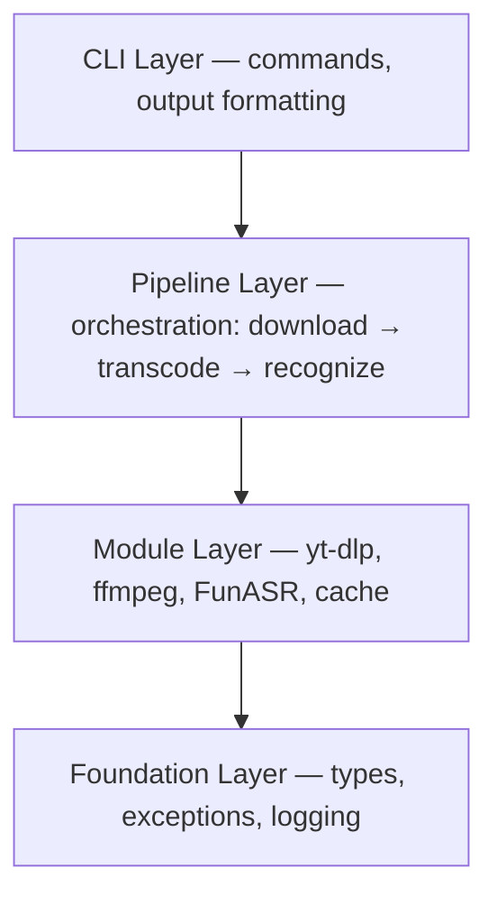
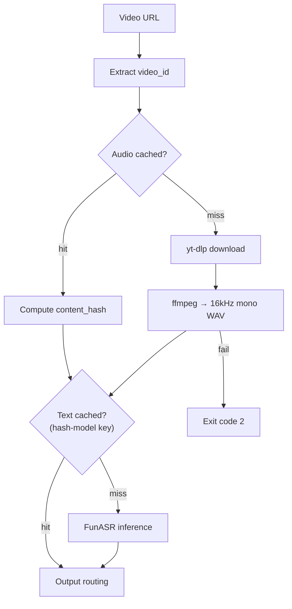

# Architecture Design — Vid2Text-Skill

**Languages**: [中文](architecture-zh-CN.md)

## 1. Overview

Vid2Text-Skill downloads audio from video URLs and transcribes it via on-device ASR, powered by yt-dlp covering most major video platforms. Distributed as a `.skill` file for AI Agents.

**Core goals**: zero API dependency, Agent-first output contract, tolerance by default.

## 2. Layered Architecture

Four layers, downward-only dependency. Inter-layer communication uses typed dataclass contracts — no raw dictionaries, no abstract base classes.

## 3. Module Boundaries

| Module | Owns | Does Not Own |
|--------|------|--------------|
| `cli.py` | Argument parsing, output formatting | Business logic, external processes |
| `pipeline.py` | Workflow orchestration, result enrichment | File I/O, external tool invocation |
| `downloader.py` | URL validation, yt-dlp, audio cache | Transcoding, ASR |
| `transcoder.py` | ffmpeg → 16kHz mono WAV | Download, recognition |
| `recognizer.py` | Model resolution, FunASR inference, text cache | Audio acquisition, format conversion |
| `cache.py` | Content hashing, two-level keys, filesystem index | Content semantics |
| `utils.py` | Exceptions, logger, type contracts | Business workflow |

## 4. Data Flow

- **Primary path**: `URL → download → transcode → ASR → output`
- **Full cache hit**: skips download and ASR, resolves in milliseconds
- **Transcode failure**: immediate termination with exit code 2 (hard prerequisite)

Output routing: without `-o`, STDOUT receives full text; with `-o`, the file holds the result and STDOUT gets only `file_path \t word_count \t duration_sec`.

## 5. Key Design Decisions

### Two-level cache keys

Audio is keyed by `video_id` (extractable before download), enabling network-free shortcuts. Text is keyed by `{content_hash}-{model_alias}`, isolating Paraformer from SenseVoice results. Switching models never returns stale data, and identical audio maps to the same text cache entry regardless of origin.

### Compute-then-route output

The pipeline computes the full result before choosing the output path. This eliminates streaming complexity while keeping the Agent's parsing surface predictable — either a full body or a one-line digest.

### Graceful cache degradation

Cache read failures are silently treated as misses; the pipeline falls through to the full path without surfacing errors. Write failures are logged but never block. Caching is purely an acceleration mechanism.

### Three-tier exit codes

| Code | Meaning | Agent Action |
|------|---------|--------------|
| 0 | Success | Present output |
| 1 | User error (invalid URL, missing file, unknown model) | Report, wait for correction |
| 2 | System error (missing dependency, download/transcode/ASR failure) | Inspect environment |

Code 1 is user-fixable; code 2 requires environment inspection.

## 6. Error Handling Strategy

### Exception hierarchy

All exceptions inherit from `Vid2TextError`. Three branches: `UserError` (bad inputs), `DependencyError` (yt-dlp/ffmpeg failures), `ModelError` (ASR loading or inference faults).

### Fault containment

| Layer | Policy |
|-------|--------|
| CLI | Catches all, maps to exit codes; no stack traces exposed |
| Pipeline | Propagates upward — each stage succeeds or terminates the chain |
| Module | Converts external errors into typed exceptions |
| Cache | Read path never throws; missing or corrupt returns `None` |

### Tolerance posture

| Scenario | Behavior |
|----------|----------|
| Model not cached | Auto-download from ModelScope (~1–2 GB) |
| Cache write fails | Warn, continue with successful result |
| Transcode fails | Exit code 2 immediately (ffmpeg is non-negotiable) |
| Single ASR segment fails | Skip and continue |
