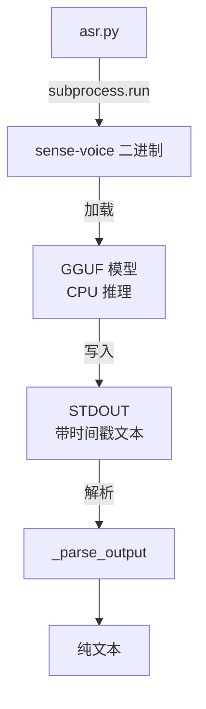

# ASR 识别模块

`asr.py` 不链接任何深度学习库。推理通过 `subprocess` 调用预编译的 C 二进制 `sense-voice` 完成，Python 层负责解析 STDOUT 输出。

## 调用架构

## 模型

| 模型 | 格式 | 大小 | 位置 |
|------|------|------|------|
| SenseVoice-Small Q4_K | GGUF | 174MB | `models/sense-voice-small-q4_k.gguf` |

模型内嵌于项目，不需在线下载。

## 二进制

| 平台 | 路径 |
|------|------|
| macOS arm64 | `bin/darwin-arm64/sense-voice` |
| Linux x64 | `bin/linux-x64/sense-voice` |
| Windows x64 | `bin/win-x64/sense-voice.exe` |

编译来源：[lovemefan/SenseVoice.cpp](https://github.com/lovemefan/SenseVoice.cpp) 静态编译。

## 调用参数

| 参数 | 含义 |
|------|------|
| `-m` | 模型文件路径 |
| `-t 4` | 解码线程数 |
| `-l auto` | 自动检测语言 |
| `-itn` | 逆文本正则化（数字、标点规范化） |
| `-nt` | 不打印时间戳 |
| `-np` | 不打印进度信息 |
| `-ng` | 禁用 GPU（Metal）后端，规避 Apple Silicon 上 q4_k 量化对齐崩溃 |
| `-mc 500` | 限制 prompt 上下文，防止 448 token 文本窗口溢出 |
| `-ml 2000` | 限制单段输出长度，避免误差累积 |
| `-sow` | 按词边界切分，保证 prompt 语义完整 |
| `-et 2.6` | 更严格的熵阈值，提前检测解码器幻觉循环 |

后五个参数为防幻觉/兼容性参数。`-ng` 解决 Apple Silicon 上 q4_k 模型的 GGML 对齐崩溃；`-mc`/`-ml`/`-sow`/`-et` 共同抑制长音频（如 47 分钟视频）转写时解码器进入重复循环并静默丢弃片段的问题——其根因是 SenseVoice 模型 448 token 的文本上下文窗口在长内容下溢出。

## 输出解析

已传 `-nt` 请求二进制不输出时间戳，`_parse_output()` 提供防御性兜底：正则剥离行首 `[时间戳]` 前缀并过滤空行后合并。

## 错误处理

| 错误场景 | 异常 |
|----------|------|
| 二进制缺失 | `ModelError` |
| 模型缺失 | `ModelError` |
| 推理失败（returncode ≠ 0） | `ModelError` |
| 不支持的操作系统 | `ModelError` |

详见 [错误类型](errors.md)。
