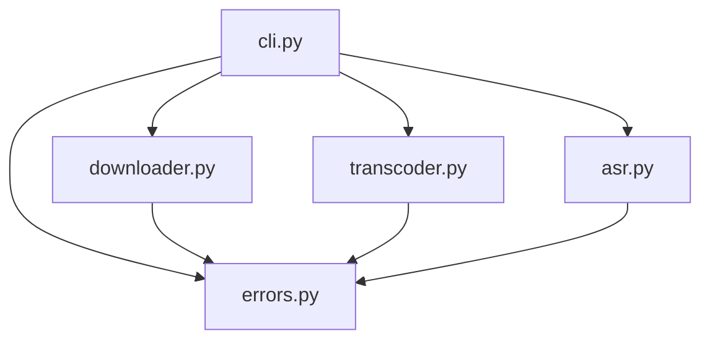
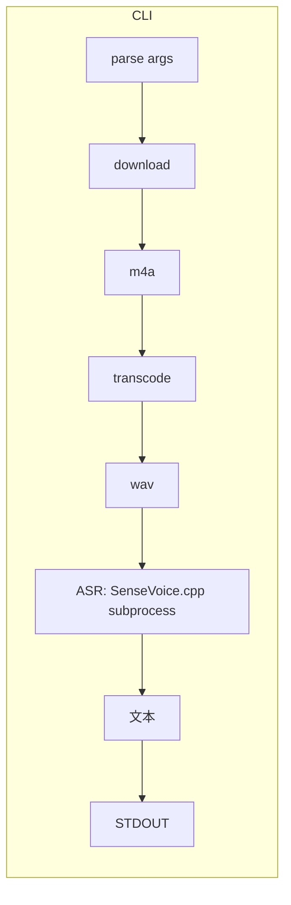
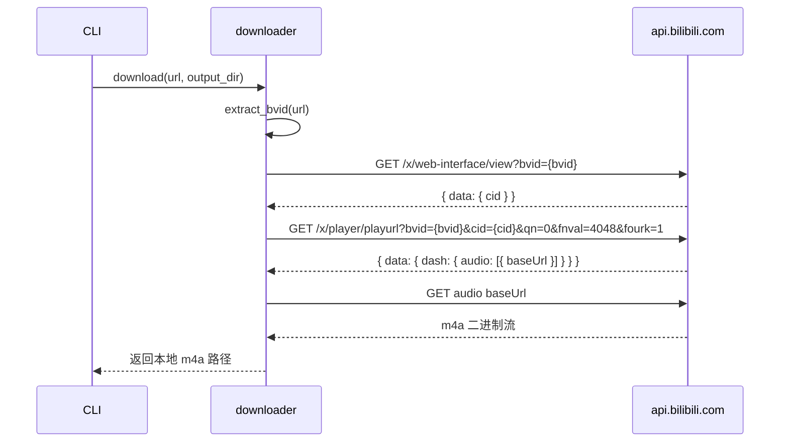

# Vid2Text 开发文档

## 1. 项目总览

Vid2Text 从 B站视频链接提取音频，通过 SenseVoice.cpp GGUF 模型进行语音识别，输出纯文本转写结果。

### 完整流水线


### 技术栈

| 层 | 技术 |
|----|------|
| 音频下载 | urllib + B站 Web API（`x/web-interface/view`、`x/player/playurl`） |
| 音频转码 | PyAV（`av` 库） |
| 语音识别 | SenseVoice.cpp GGUF (Q4_K) + C 二进制 subprocess 调用 |
| CLI 框架 | click |
| 打包 | build_skill.py 生成 .skill zip 产物 |

### 项目目录结构

```
vid2text/
├── __init__.py
├── cli.py              # CLI 入口（click）
├── downloader.py       # B站 API 直连下载
├── transcoder.py       # PyAV 转码
├── asr.py              # SenseVoice.cpp 推理（subprocess 调用 C 二进制）
└── errors.py           # 异常类型定义
```

---

## 2. 模块架构

### 模块依赖关系



### 各模块职责

| 模块 | 文件 | 职责 | 输入 | 输出 |
|------|------|------|------|------|
| CLI 入口 | `cli.py` | 参数解析、流程编排、退出码 | 命令行参数 | STDOUT / 退出码 |
| 下载 | `downloader.py` | B站 API 直连下载 m4a | URL 或 BVID | 本地 m4a 文件路径 |
| 转码 | `transcoder.py` | PyAV m4a → WAV | m4a 路径 | 16kHz 单声道 WAV 路径 |
| ASR | `asr.py` | subprocess 调用 sense-voice 二进制，解析输出 | WAV 路径 | 纯文本字符串 |
| 异常 | `errors.py` | 异常类型定义与 exit_code 映射 | — | 异常类 |

### 数据流



### 进程模型

单进程、同步执行。不使用线程或 async。流水线各阶段按序执行，前一步完成才进入下一步。使用 `tempfile.TemporaryDirectory()` 存放中间文件，进程退出后自动清理。

### 入口文件

`vid2text/cli.py` 中的 `main_entry()` 函数是唯一入口。`pyproject.toml` 注册为 `vid2text` 控制台脚本。

```toml
[project.scripts]
vid2text = "vid2text.cli:main_entry"
```

---

## 3. 错误类型

所有错误继承基类 `Vid2TextError`，通过 `exit_code` 属性控制进程退出码。CLI 层捕获后取 `exit_code` 作为退出码，`str(e)` 输出到 STDERR。

| 错误类型 | 基类 | exit_code | 触发条件 |
|----------|------|-----------|----------|
| `UserError` | `Vid2TextError` | 1 | 无效链接、不含可识别的 BV 号 |
| `NetworkError` | `Vid2TextError` | 2 | B站 API 请求失败、音频下载失败 |
| `TranscodeError` | `Vid2TextError` | 2 | 转码失败 |
| `ModelError` | `Vid2TextError` | 2 | 模型文件损坏、推理异常、不支持的操作系统 |

---

## 4. 下载模块

`downloader.py` 负责从 B站 API 获取音频直链并下载到本地。

### API 调用流程



### 步骤一：获取视频信息

```
GET https://api.bilibili.com/x/web-interface/view?bvid={bvid}
```

**请求头**：

| 头 | 值 |
|----|-----|
| `User-Agent` | `Mozilla/5.0 (Windows NT 10.0; Win64; x64) AppleWebKit/537.36 (KHTML, like Gecko) Chrome/131.0.0.0 Safari/537.36` |
| `Referer` | `https://www.bilibili.com/` |

**关键返回字段**：`data.cid`。`code != 0` 时抛出 `NetworkError`。

### 步骤二：获取音频流地址

```
GET https://api.bilibili.com/x/player/playurl?bvid={bvid}&cid={cid}&qn=0&fnval=4048&fourk=1
```

**参数说明**：

| 参数 | 值 | 含义 |
|------|-----|------|
| `qn` | `0` | 不限画质 |
| `fnval` | `4048` | 请求 DASH 流（含独立音频轨） |
| `fourk` | `1` | 允许 4K |

**关键返回字段**：`data.dash.audio[0].baseUrl`（音频直链）。`audio` 数组为空时抛出 `NetworkError`。

### 步骤三：下载音频

对 `baseUrl` 发起 HTTP GET，请求头同步骤一。读取超时 120 秒，API 请求超时 30 秒。分 64KB 块写入本地文件，文件名格式 `{bvid}.m4a`。

### BV 号提取

正则 `BV[0-9A-Za-z]{10}` 从输入中提取 BV 号。输入可以是完整 URL 或纯 BV 号。匹配失败时抛出 `UserError`。

### 平台分派

通过 BV 正则或 URL 关键词匹配下载函数。当前仅注册 `"bilibili"`。无匹配时抛出 `NetworkError`。

```python
_DOWNLOADERS: dict[str, Callable] = {
    "bilibili": _download_bilibili,
}
```

---

## 5. 转码模块

`transcoder.py` 使用 PyAV（`av`）将音频转为 16kHz 单声道 WAV，供 ASR 模块消费。

### PyAV 转码

```python
import av

container = av.open("input.m4a")
output_container = av.open("output.wav", "w")
output_stream = output_container.add_stream("pcm_s16le", rate=16000, layout="mono")
resampler = av.audio.resampler.AudioResampler(
    format="s16",
    layout="mono",
    rate=16000,
)
```

`av` 通过 `pip install av` 自动安装，零系统依赖。

### 跳过转码

输入已是 `.wav` 后缀时跳过转码，直接返回原路径。

---

## 6. ASR 识别模块

### 架构

Vid2Text 不直接链接任何深度学习库。ASR 推理通过 `subprocess` 调用预编译的 C 二进制 `sense-voice` 完成。二进制输出带时间戳的文本到 STDOUT，Python 层负责解析和剥离时间戳。

```
Python (asr.py)
    │ subprocess.run(["sense-voice", "-m", "...", "-t", "4", "...", "audio.wav"])
    ▼
C 二进制 (sense-voice)
    │ GGUF 模型加载 + CPU 推理
    ▼
STDOUT: "[0.54-3.78] 甚至出现交易几乎停滞的情况。"
    │ _parse_output(stdout) → 剥离时间戳，合并空行
    ▼
"甚至出现交易几乎停滞的情况。"
```

### 模型

| 模型 | 格式 | 大小 | 位置 |
|------|------|------|------|
| SenseVoice-Small Q4_K | GGUF | 174MB | `models/sense-voice-small-q4_k.gguf` |

模型已内嵌于项目中，不需要在线下载。

### 二进制

| 平台 | 路径 | 名称 |
|------|------|------|
| macOS arm64 | `bin/darwin-arm64/` | `sense-voice` |
| Linux x64 | `bin/linux-x64/` | `sense-voice` |
| Windows x64 | `bin/win-x64/` | `sense-voice.exe` |

编译流程：`git clone → cmake -DBUILD_SHARED_LIBS=OFF → make`，从 [lovemefan/SenseVoice.cpp](https://github.com/lovemefan/SenseVoice.cpp) 源码静态编译。

### 命令行参数

```bash
sense-voice -m <model.gguf> -t 4 -l auto -itn -nt -np <audio.wav>
```

| 参数 | 含义 |
|------|------|
| `-m` | 模型文件路径 |
| `-t 4` | 解码线程数 |
| `-l auto` | 自动检测语言 |
| `-itn` | 启用逆文本正则化（数字、标点规范化） |
| `-nt` | 不打印时间戳 |
| `-np` | 不打印处理进度信息 |

### 输出解析

命令行已传 `-nt` 请求二进制不输出时间戳，`_parse_output()` 作为防御性兜底：即便个别情况下二进制仍残留 `[时间戳]` 前缀或空行，也会被剥离合并。处理逻辑：

1. 正则剥离每行开头的 `[时间戳]` 前缀
2. 过滤空行后合并

### 错误处理

| 错误 | 异常 |
|------|------|
| 二进制文件缺失 | `ModelError`，退出码 2 |
| 模型文件缺失 | `ModelError`，退出码 2 |
| ASR 推理失败（returncode != 0） | `ModelError`，退出码 2 |
| 不支持的操作系统 | `ModelError`，退出码 2 |

---

## 7. CLI 入口

`cli.py` 是唯一命令行入口，基于 click 框架。

### 命令结构

单一命令，无子命令组：

```
vid2text <url|bvid>
vid2text --version
```

### `vid2text <url|bvid>`

位置参数接受完整 B站链接或纯 BV 号。执行完整流水线：下载 → 转码 → ASR 推理 → 输出文本。

使用 `tempfile.TemporaryDirectory()` 作为工作目录，所有中间文件在进程退出时自动清理。

### `vid2text --version`

输出版本号，不做任何处理。

### 退出码

| 退出码 | 含义 | Agent 处置 |
|--------|------|------------|
| 0 | 成功 | 读取 STDOUT |
| 1 | 用户错误（无效链接、无 BV 号、缺少参数） | 修正输入后重试 |
| 2 | 系统错误（网络、转码、ASR 推理失败） | 检查环境或报用户 |

### STDOUT / STDERR 分工

| 输出内容 | 通道 |
|----------|------|
| 转写文本 | STDOUT |
| 版本信息 | STDOUT |
| 使用提示（无参数时） | STDERR |
| 错误信息 | STDERR |

STDOUT 始终是纯文本内容，Agent 无需解析或过滤。

---

## 8. 打包配置

使用 `scripts/build_skill.py` 将项目打包为 `.skill` zip 产物。

### 产物内容

```
vid2text.skill
├── SKILL.md
├── pyproject.toml
├── vid2text/
│   ├── __init__.py
│   ├── asr.py
│   ├── cli.py
│   ├── downloader.py
│   ├── errors.py
│   └── transcoder.py
├── bin/
│   ├── darwin-arm64/sense-voice
│   ├── linux-x64/sense-voice
│   └── win-x64/sense-voice.exe
└── models/
    └── sense-voice-small-q4_k.gguf
```

### 安装方式

- **开发**：`pip install -e .`
- **发行**：GitHub Releases 下载 `.skill` 文件，解压后 `pip install -e .` 即可

### 模型

模型文件（174MB GGUF）内嵌于 `.skill` 产物中，不需要在线下载。
