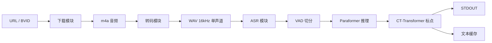
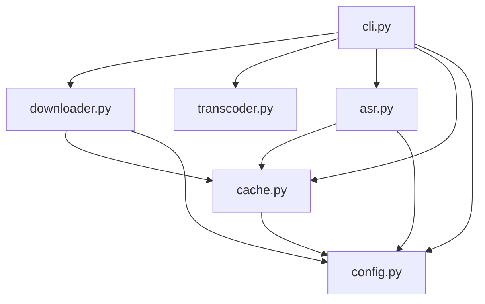
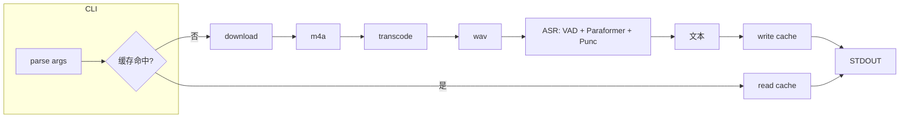
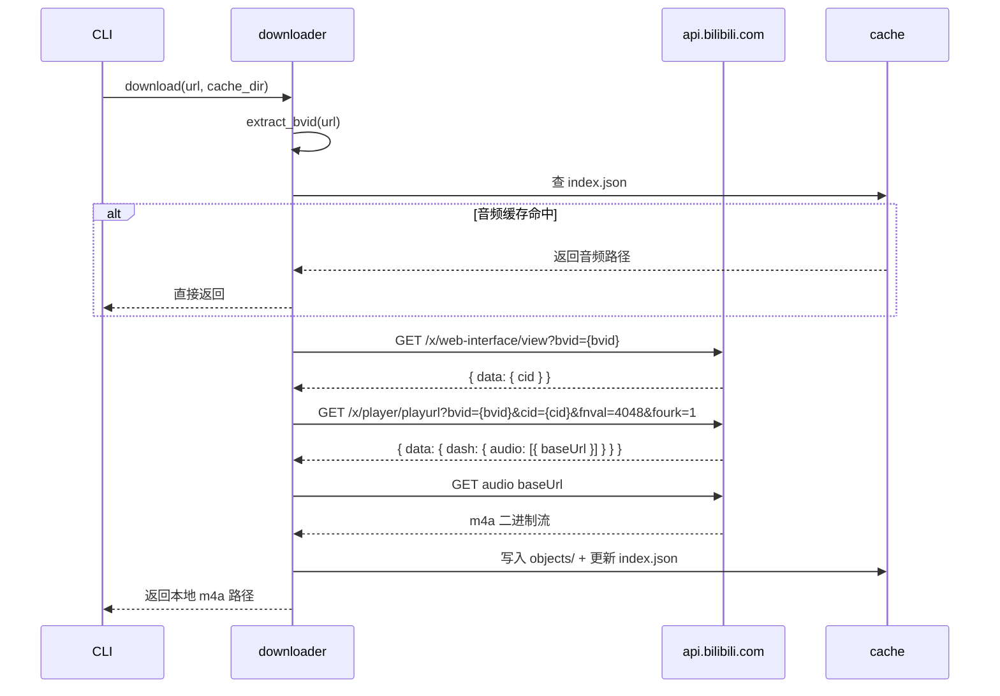
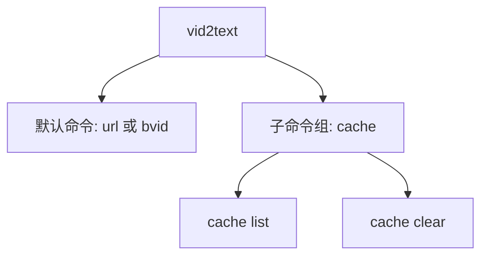

# Vid2Text 开发文档

## 1. 项目总览

Vid2Text 从 B站视频链接提取音频，经 ONNX 语音识别输出纯文本转写结果。

### 完整流水线



### 技术栈

| 层 | 技术 |
|----|------|
| 音频下载 | urllib + B站 Web API（`x/web-interface/view`、`x/player/playurl`） |
| 音频转码 | ffmpeg（内嵌，`-ar 16000 -ac 1 -f wav`） |
| 语音识别 | SenseVoice.cpp GGUF (Q4_K) + C 二进制 subprocess 调用 |
| 模型下载 | ModelScope snapshot_download |
| CLI 框架 | click |
| 打包 | PyInstaller（`--onefile`，内嵌 ffmpeg） |

### 项目目录结构

```
vid2text/
├── __init__.py
├── cli.py              # CLI 入口（click）
├── downloader.py       # B站 API 直连下载
├── transcoder.py       # ffmpeg 转码
├── asr.py              # SenseVoice.cpp 推理（subprocess 调用 C 二进制）
└── errors.py           # 异常类型定义
```

---

## 2. 模块架构

### 模块依赖关系



### 各模块职责

| 模块 | 文件 | 职责 | 输入 | 输出 |
|------|------|------|------|------|
| CLI 入口 | `cli.py` | 参数解析、流程编排、退出码 | 命令行参数 | STDOUT / 退出码 |
| 下载 | `downloader.py` | B站 API 直连下载 m4a | URL 或 BVID | 本地 m4a 文件路径 |
| 转码 | `transcoder.py` | ffmpeg m4a → WAV | m4a 路径 | 16kHz 单声道 WAV 路径 |
| ASR | `asr.py` | 模型加载、SenseVoiceSmall 推理（内置标点） | WAV 路径 | 纯文本字符串 |
| 缓存 | `cache.py` | git 式内容寻址、index.json 管理 | 文件路径 + 文本 | 命中/未命中 + 淘汰 |
| 配置 | `config.py` | config.json 读写、默认值回退 | — | 配置字典 |

### 数据流



### 进程模型

单进程、同步执行。不使用线程或 async。流水线各阶段按序执行，前一步完成才进入下一步。

### 入口文件

`vid2text/cli.py` 中的 `main_entry()` 函数是唯一入口。`pyproject.toml` 注册为 `vid2text` 控制台脚本。

```toml
[project.scripts]
vid2text = "vid2text.cli:main_entry"
```

---

## 3. 关键数据结构

### index.json

维护视频 ID 到缓存文件的映射。位于 `~/.vid2text/cache/index.json`。

键格式：`"{platform}:{video_id}"`（如 `"bilibili:BV1wDEK6MEM2"`）。

| 字段 | 类型 | 说明 |
|------|------|------|
| `audio` | `string` | 音频文件 SHA256 完整哈希（64 位 hex） |
| `text` | `object` | 模型别名 → 文本文件 SHA256 完整哈希 |

实际 JSON 示例：

```json
{
  "bilibili:BV1wDEK6MEM2": {
    "audio": "a1b2c3d4e5f6a7b8c9d0e1f2a3b4c5d6e7f8a9b0c1d2e3f4a5b6c7d8e9f0",
    "text": { "paraformer": "d6c5b4a3f2e1d0c9b8a7f6e5d4c3b2a1f0e9d8c7b6a5f4d3e2b1a0" }
  }
}
```

### config.json

技能级全局配置。位于 `~/.vid2text/config.json`，首次运行自动生成。每次启动时读取，读取失败使用内置默认值。当前仅含 `cache` 段，未来可扩展（模型选择、线程数等）。

| 字段 | 类型 | 默认值 | 说明 |
|------|------|--------|------|
| `cache.max_age_days` | `int` | `30` | 超期天数，超期条目视为未命中 |
| `cache.max_total_mb` | `int` | `500` | objects 总容量上限 |

读取规则：浅合并用户文件与默认值。文件不存在或 JSON 解析失败时返回默认值。

### 错误类型

所有错误继承基类，通过 `exit_code` 属性控制进程退出码。CLI 层捕获后取 `exit_code` 作为退出码，`str(e)` 输出到 STDERR。

| 错误类型 | 基类 | exit_code | 触发条件 |
|----------|------|-----------|----------|
| `UserError` | `Vid2TextError` | 1 | 无效链接、不含可识别的 BV 号 |
| `NetworkError` | `Vid2TextError` | 2 | B站 API 请求失败、音频下载失败、模型下载失败 |
| `TranscodeError` | `Vid2TextError` | 2 | ffmpeg 返回非零、输出文件未生成 |
| `ModelError` | `Vid2TextError` | 2 | 模型文件损坏、推理异常 |

### SHA256 哈希规范

- 输入为文件时：对文件内容（二进制流）计算 SHA256
- 输入为字符串时：对 UTF-8 编码后的字节计算 SHA256
- 输出：完整 64 位 hex 字符串，不截取
- 用途：音频内容哈希、文本内容哈希均使用相同算法

### objects/ 文件路径规则

```
{cache_dir}/objects/{sha256[:2]}/{sha256[2:]}.{ext}
```

- `sha256[:2]`：前 2 位 hex 为子目录名（防单目录文件数过多）
- `sha256[2:]`：后 62 位 hex 为文件名
- `ext`：`m4a`（音频）或 `txt`（文本）

---

## 4. 下载模块

`downloader.py` 负责从 B站 API 获取音频直链并下载到本地。

### API 调用流程



### 步骤一：获取视频信息

```
GET https://api.bilibili.com/x/web-interface/view?bvid={bvid}
```

**请求头**：

| 头 | 值 |
|----|-----|
| `User-Agent` | `Mozilla/5.0 (Windows NT 10.0; Win64; x64) AppleWebKit/537.36 (KHTML, like Gecko) Chrome/131.0.0.0 Safari/537.36` |
| `Referer` | `https://www.bilibili.com/` |

**关键返回字段**：`data.cid`、`data.bvid`、`data.title`、`data.duration`。`code != 0` 时抛出 `NetworkError`。

### 步骤二：获取音频流地址

```
GET https://api.bilibili.com/x/player/playurl?bvid={bvid}&cid={cid}&qn=0&fnval=4048&fourk=1
```

**参数说明**：

| 参数 | 值 | 含义 |
|------|-----|------|
| `qn` | `0` | 不限画质 |
| `fnval` | `4048` | 请求 DASH 流（含独立音频轨） |
| `fourk` | `1` | 允许 4K |

**关键返回字段**：`data.dash.audio[0].baseUrl`（音频直链）、`data.dash.audio[0].codecs`（编码格式，通常为 `mp4a.40.2`）。`audio` 数组为空时抛出 `NetworkError`。

### 步骤三：下载音频

对 `baseUrl` 发起 HTTP GET，请求头同步骤一。超时 120 秒。写入 `objects/` 目录后计算 SHA256 并更新 `index.json`。下载过程通过 tqdm 显示进度条。

### BV 号提取

正则 `BV[0-9A-Za-z]{10}` 从输入中提取 BV 号。输入可以是完整 URL 或纯 BV 号。匹配失败时抛出 `UserError`。

### 平台分派

通过 URL 关键词匹配下载函数。M0 仅注册 `"bilibili"`。无匹配时抛出 `NetworkError`。

```python
_DOWNLOADERS: dict[str, Callable] = {
    "bilibili": _download_bilibili,
}
```

### 缓存集成

下载前先查 `index.json` 中对应 `{platform}:{video_id}` 的条目。命中则直接返回 `objects/` 中的音频路径，跳过下载。

---

## 5. 转码模块

`transcoder.py` 调用 ffmpeg 将音频转为 16kHz 单声道 WAV，供 ASR 模块消费。

### ffmpeg 命令

```bash
ffmpeg -y -i input.m4a -vn -ar 16000 -ac 1 -f wav output.wav
```

| 参数 | 含义 |
|------|------|
| `-y` | 覆盖已存在的输出文件 |
| `-i input.m4a` | 输入文件 |
| `-vn` | 丢弃视频轨（纯音频） |
| `-ar 16000` | 重采样到 16kHz |
| `-ac 1` | 混音为单声道 |
| `-f wav` | 输出 PCM WAV 格式 |

### 跳过转码

输入已是 `.wav` 后缀时跳过转码，直接返回原路径。

### ffmpeg 路径解析

- 打包为 exe 后：从 `sys._MEIPASS / ffmpeg.exe` 获取
- 开发环境：从 `shutil.which("ffmpeg")` 查找 PATH
- 均失败：抛出 `TranscodeError`

### 错误处理

| 场景 | 行为 |
|------|------|
| 输入文件不存在 | `FileNotFoundError` 向上传播 |
| ffmpeg 返回非零 | `TranscodeError`，STDERR 输出 ffmpeg 错误日志 |
| 输出文件未生成 | `TranscodeError` |

---

### 6. ASR 识别模块

#### 架构

Vid2Text 不直接链接任何深度学习库。ASR 推理通过 `subprocess` 调用预编译的 C 二进制 `sense-voice` 完成。二进制输出文本到 STDOUT，Python 层负责解析和剥离时间戳。

```
Python (asr.py)
    │ subprocess.run(["sense-voice", "-m", "...", "audio.wav"])
    ▼
C 二进制 (sense-voice)
    │ GGUF 模型加载 + Metal/CUDA 推理
    ▼
STDOUT: "[0.54-3.78] 甚至出现交易几乎停滞的情况。"
    │ _parse_output(stdout) → 剥离时间戳
    ▼
"甚至出现交易几乎停滞的情况。"
```

#### 模型

| 模型 | 格式 | 大小 | 位置 |
|------|------|------|------|
| SenseVoice-Small Q4_K | GGUF | 174MB | `models/sense-voice-small-q4_k.gguf` |

模型已内嵌于 `.skill` 产物中，不需要在线下载。

#### 二进制

| 平台 | 路径 | 大小 |
|------|------|------|
| macOS arm64 | `bin/darwin-arm64/sense-voice` | ~300KB |
| Linux x64 | `bin/linux-x64/sense-voice` | ~300KB |
| Windows x64 | `bin/win-x64/sense-voice.exe` | ~300KB |

编译流程：`git clone → cmake -DBUILD_SHARED_LIBS=OFF → make`，从 [lovemefan/SenseVoice.cpp](https://github.com/lovemefan/SenseVoice.cpp) 源码静态编译。

#### 线程数配置

二进制通过 `-t 4` 参数控制解码线程数。不使用环境变量。

#### 错误处理

| 错误 | 异常 |
|------|------|
| 二进制文件缺失 | `ModelError`，退出码 2 |
| 模型文件缺失 | `ModelError`，退出码 2 |
| ASR 推理失败 | `ModelError`，退出码 2 |
| 不支持的平台 | `ModelError`，退出码 2 |

#### 模块接口

| 模块 | 文件 | 职责 | 输入 | 输出 |
|------|------|------|------|------|
| ASR | `asr.py` | subprocess 调用 sense-voice 二进制，解析输出 | WAV 路径 | 纯文本字符串 |

---

## 7. 缓存模块

`cache.py` 实现 git 式内容寻址缓存，通过 `index.json` 维护映射，支持时间和空间双维度自动淘汰。

### 目录结构

```
~/.vid2text/cache/
├── objects/
│   ├── a1/b2c3d4...m4a     # 音频
│   └── d6/c5b4a3...txt     # 文本
└── index.json               # 映射表
```

### index.json 原子写入

写入时先写临时文件 `index.tmp`，完成后 `os.replace` 覆盖原文件。防止写入中断导致 index 损坏。读取失败（文件不存在或 JSON 解析错误）返回空字典 `{}`。

### object 文件操作契约

| 操作 | 输入 | 行为 | 失败时 |
|------|------|------|--------|
| **write** | `hash_hex` + 文件路径或字符串 + 扩展名 | 复制文件或写入字符串到 `objects/{h[:2]}/{h[2:]}.{ext}` | 静默降级（磁盘满等不中断主流程） |
| **read** | `hash_hex` + 扩展名 | 读取并返回文件内容 | 视为未命中 |
| **exists** | `hash_hex` + 扩展名 | 返回文件是否存在 | 视为不存在 |

### 时间淘汰

读取缓存前执行。遍历 `index.json` 所有条目，对每个条目取音频文件 mtime。超过 `max_age_days` 的条目从 `index.json` 删除，同时删除对应的 `objects/` 文件（音频 + 文本）。当文件已被手动删除但 index 残留时，同步清理 index（僵尸条目清理）。

### 空间淘汰

写入缓存后执行。统计 `objects/` 目录总大小。超过 `max_total_mb` 时，按条目中最旧文件的 mtime 排序，从最旧条目开始逐一删除（删除 `objects/` 文件并从 `index.json` 移除），直到总量 ≤ 限额。极端情况下（仅当前文件就超限且无其他条目可删），当前文件保留，不做进一步处理。

### cache list

遍历 `index.json`，按 key 排序输出。格式：

```
bilibili:BV1wDEK6MEM2
  audio: a1b2c3d4e5f6a7b8...
  text/paraformer: d6c5b4a3f2e1d0c9...
```

### cache clear

删除 `objects/` 目录，将 `index.json` 重置为 `{}`。模型文件不受影响。

### 错误处理

| 场景 | 行为 |
|------|------|
| `index.json` 不存在 | 返回 `{}`，视为空缓存 |
| `index.json` 损坏 | 返回 `{}`，旧索引丢失 |
| object 文件缺失（index 有记录） | 视为未命中，运行时清理僵尸条目 |
| 磁盘满（写入失败） | 静默降级，缓存写入失败不中断主流程 |

---

## 8. CLI 入口

`cli.py` 是唯一命令行入口，基于 click 框架。

### 命令结构



### 命令格式

```
vid2text <url|bvid> [--no-cache]
vid2text cache list
vid2text cache clear
```

### `vid2text <url|bvid>`

位置参数接受完整 B站链接或纯 BV 号。`--no-cache` 彻底重跑：不读缓存、不写缓存、重新下载和推理。

### `vid2text cache list`

遍历 `index.json`，输出所有缓存条目。无条目时输出 `(空)`。

### `vid2text cache clear`

清空 `objects/` 目录，重置 `index.json` 为 `{}`。不删除模型文件。

### 退出码

| 退出码 | 含义 | Agent 处置 |
|--------|------|------------|
| 0 | 成功 | 读取 STDOUT |
| 1 | 用户错误 | 修正输入后重试 |
| 2 | 系统错误 | 检查环境或报用户 |

### STDOUT / STDERR 分工

| 输出内容 | 通道 |
|----------|------|
| 转写文本 | STDOUT |
| cache list 输出 | STDOUT |
| 进度条（tqdm） | STDERR |
| 错误信息 | STDERR |
| 状态提示（下载完成等） | STDERR |

STDOUT 始终是纯文本内容，Agent 无需解析或过滤。

---

## 9. 打包配置

使用 PyInstaller 将项目打包为单文件 exe，内嵌 ffmpeg。

### PyInstaller 命令

```bash
pyinstaller \
  --onefile \
  --name vid2text \
  --add-binary "ffmpeg.exe;." \
  --collect-all funasr_onnx \
  --collect-all modelscope \
  --hidden-import funasr_onnx.paraformer_bin \
  --hidden-import funasr_onnx.vad_bin \
  --hidden-import funasr_onnx.punc_bin \
  --hidden-import onnxruntime \
  --hidden-import onnxruntime.capi \
  vid2text/cli.py
```

### 参数说明

| 参数 | 含义 |
|------|------|
| `--onefile` | 输出单文件 exe |
| `--name vid2text` | 产物命名为 `vid2text.exe` |
| `--add-binary "ffmpeg.exe;."` | 将 ffmpeg 打包进 exe 根目录 |
| `--collect-all funasr_onnx` | 收集 funasr_onnx 所有模块和数据文件 |
| `--collect-all modelscope` | 收集 modelscope 所有模块 |
| `--hidden-import` | 显式声明 PyInstaller 可能遗漏的隐式导入 |

### spec 文件

推荐使用 `vid2text.spec` 固化配置，便于 CI 和可复现构建：

```python
# vid2text.spec
a = Analysis(
    ["vid2text/cli.py"],
    pathex=[],
    binaries=[("ffmpeg.exe", ".")],
    datas=[],
    hiddenimports=[
        "funasr_onnx.paraformer_bin",
        "funasr_onnx.vad_bin",
        "funasr_onnx.punc_bin",
        "onnxruntime",
        "onnxruntime.capi",
    ],
    hookspath=[],
    hooksconfig={},
    runtime_hooks=[],
    excludes=[],
    noarchive=False,
)
a.datas += Tree("funasr_onnx", prefix="funasr_onnx")
a.datas += Tree("modelscope", prefix="modelscope")

pyz = PYZ(a.pure)

exe = EXE(
    pyz,
    a.scripts,
    a.binaries,
    a.datas,
    [],
    name="vid2text",
    debug=False,
    bootloader_ignore_signals=False,
    strip=False,
    upx=True,
    upx_exclude=[],
    runtime_tmpdir=None,
    console=True,
)
```

构建命令：`pyinstaller vid2text.spec`

### ffmpeg 路径解析规范

- 打包模式（`sys.frozen`）：`sys._MEIPASS / ffmpeg.exe`
- 开发模式：`shutil.which("ffmpeg")` 查找
- 均失败：抛出 `TranscodeError`

### exe 体积预估

| 组件 | 体积 |
|------|------|
| Python 运行时 | ~30MB |
| funasr_onnx + 依赖 | ~15MB |
| modelscope | ~10MB |
| onnxruntime | ~13MB |
| click + tqdm | ~2MB |
| ffmpeg.exe | ~80MB |
| **合计** | **~150MB** |

### 分发包

打包产物：`dist/vid2text.exe`。通过 GitHub Releases 分发。用户双击或命令行运行，无需安装 Python 或任何依赖。

### 模型首次下载

模型文件（~1.2GB）不打包进 exe。用户首次运行时自动从 ModelScope 下载到 `~/.cache/modelscope/`。后续无需重新下载。

---

> **相关文档**：[PRD](prd.md) — 产品需求文档
