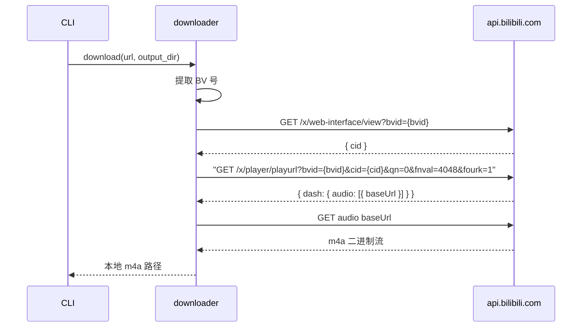

# 下载模块

`downloader.py` 通过 B站 Web API 获取音频直链并下载到本地。

## 下载流程

## API 端点

**获取视频信息**：`GET /x/web-interface/view?bvid={bvid}` → 返回 `data.cid`

**获取音频流地址**：`GET /x/player/playurl?bvid={bvid}&cid={cid}&qn=0&fnval=4048&fourk=1` → 返回 `data.dash.audio[0].baseUrl`

**参数说明**：

| 参数 | 含义 |
|------|------|
| `qn=0` | 不限画质 |
| `fnval=4048` | 请求 DASH 流（含独立音频轨） |
| `fourk=1` | 允许 4K |

**请求头**：`User-Agent`（Chrome 桌面端）与 `Referer: https://www.bilibili.com/`

## 下载与存储

对音频直链发起 HTTP GET，读取超时 120 秒，API 请求超时 30 秒。分 64KB 块写入本地，文件名 `{bvid}.m4a`。

## BV 号提取

正则 `BV[0-9A-Za-z]{10}` 从输入中提取。接受完整 URL 或纯 BV 号。匹配失败抛出 `UserError`。

## 平台分派

当前仅注册 `bilibili` 平台。无匹配抛出 `NetworkError`。
