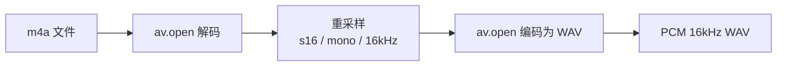

# 转码模块

`transcoder.py` 使用 PyAV 将 B站下载的 m4a 音频转为 16kHz 单声道 WAV，供 ASR 模块消费。

## 转码流程

- 输入格式：m4a（B站 DASH 音频轨）
- 输出格式：PCM s16le、16kHz、单声道 WAV
- 依赖 `av`（`pip install av`），零系统依赖

## 跳过转码

输入已是 `.wav` 后缀时跳过转码，直接返回原路径。
